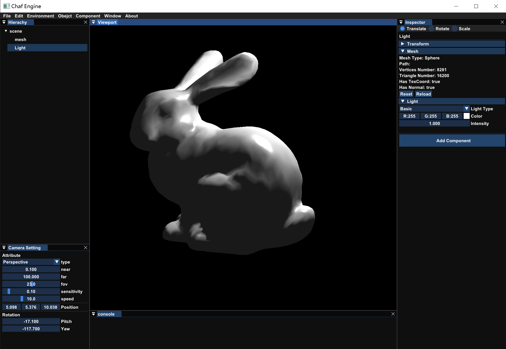

# Chaf Engine

My toy engine, including real-time rendering, offline rendering and scene editing

## Updated

I am currently working on a more efficient renderer based on Vulkan, so I may not add any new features to this renderer any longer.

But I still use `Chaf-Engine` for my homework, check:

[Computer Aided Geometric Design](https://github.com/Chaphlagical/CAGD)

[Digital Image Process](https://github.com/Chaphlagical/DIP)

## What you need?

* **Visual Studio 2019** (Haven't tested on other version or platform)

## How to download?

The Engine is only support Windows for now, you can use git command:

```shell
git clone --recursive https://github.com/Chaphlagical/ChafEngine.git
```

Download release executable file from [https://github.com/premake/premake-core/releases](https://github.com/premake/premake-core/releases) and place `premake5.exe` into `/projects`

Run the batch script `projects/Win-GenerateProject.bat`, then open the Visual Studio Project `CEngine.sln`

If you trying to run the `.exe` in `/bin`, you should copy the asserts from `/src/App`

## Feature

* Build: Premake5
* Platform: Windows 10
* Graphics API: OpenGL

- [x] Component
	- [x] Transform
	- [x] Material
		- [x] Emisson
		- [x] Phong Lighting Model
		- [x] Cook Torrance PBR Model
	- [x] Geometry
		- [x] Sphere
		- [x] Plane
		- [x] Cube
		- [x] Load .obj from File
	- [x] Light Source
		- [x] Ideal Light
		- [x] Directional Light
		- [x] Point Light
		- [x] Spot Light

## Demo

**UI**


**WireFrame**


**Phong Light Model**



**PBR**


