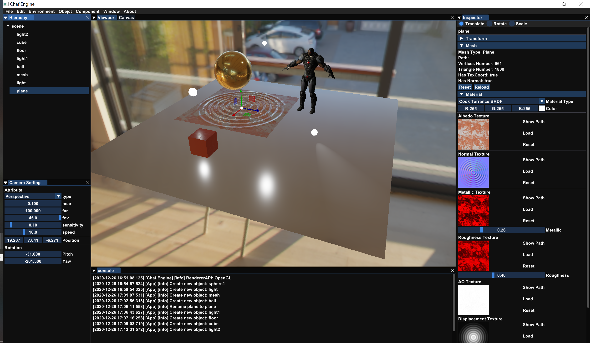
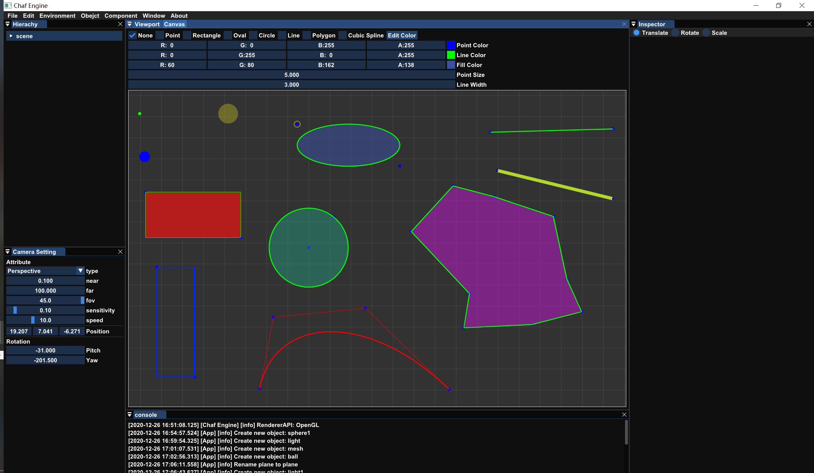
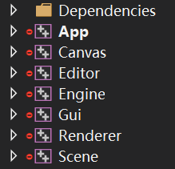
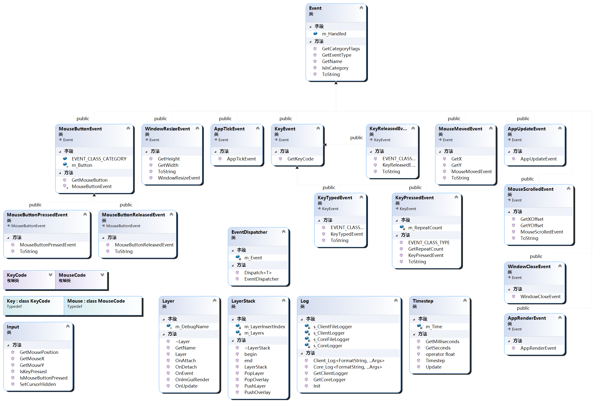
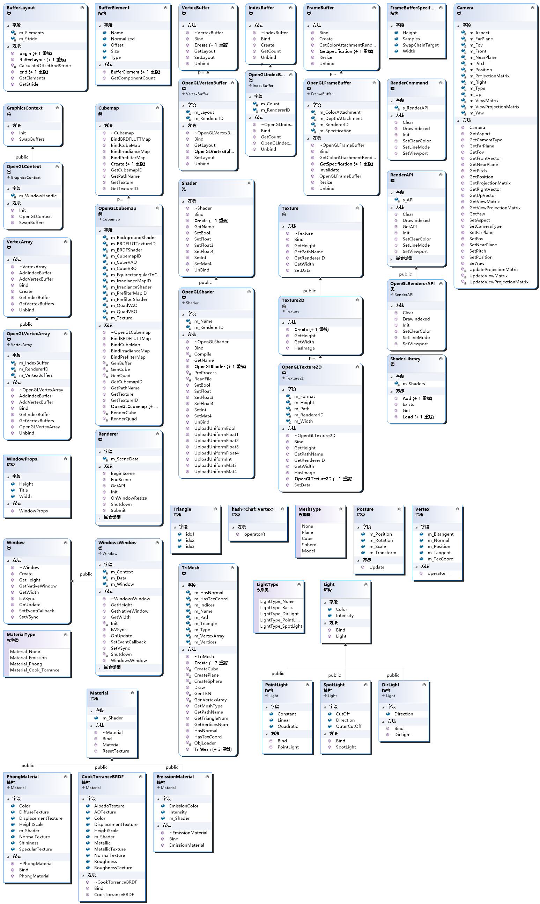
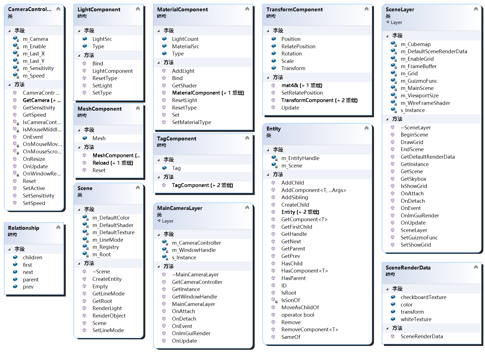
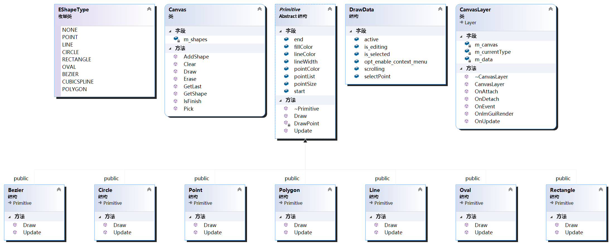

# 面向对象技术大作业报告

> PB17050948 陈文博

[TOC]

## 1. 项目简介

### 1.1. 概述

基于OpenGL图形API和立即模式gui框架，在此前自己编写的渲染器基础上新增简单绘图功能。

绘图功能包括：

* 绘制点、线、多边形、矩形、椭圆、圆、贝塞尔曲线
* 顶点位置编辑
* 顶点颜色、顶点大小、线宽、线色，闭合图形填充颜色编辑

渲染器功能包括\*：

* 日志系统

* FPS摄像机场景漫游
* `*.obj`文件导入
* 光源
  * 点光源
  * 理想光源
  * 手电筒
  * 单向光
* 材质
  * 简单贴图
  * Phong光照模型
  * Cook Torrance BRDF材质模型

### 1.2. 基本展示






## 2. 项目搭建

### 2.1. 开发环境

**操作系统**：Windows 10 专业版

**CPU**：AMD Ryzen 5 3500X 6-Core Processor 3.60 GHz

**GPU**：NVIDIA GeForce RTX 2060 SUPER

**IDE：** Visual Studio Community 2019

### 2.2. 项目依赖

* **Premake**
  * Github地址：[https://github.com/premake/premake-core](https://github.com/premake/premake-core)
  * 用于项目的构建，基于Lua脚本，简单好用

* **glfw**
  * Github地址：[https://github.com/glfw/glfw](https://github.com/glfw/glfw)
  * The OpenGL Extension Wrangler Library，对底层OpenGL接口的封装，用于跨平台，提供窗口操作等基本功能
* **glad**
  * 下载地址：[https://glad.dav1d.de/](https://glad.dav1d.de/)
  * glad用于访问当前最新的OpenGL规范接口，和glfw配合使用
* **dear-imgui**
  * Github地址：[https://github.com/ocornut/imgui](https://github.com/ocornut/imgui)
  * 立即模式gui（Immediate Mode Gui）框架，与Qt等rmgui不同，imgui提供多种图形API接口，渲染过程中进行每帧绘制，上手快，编写简单
* **spdlog**
  * Github地址：[https://github.com/gabime/spdlog](https://github.com/gabime/spdlog)
  * header-only日志库，用于日志信息的打印与保存
* **stb**
  * Github地址：[https://github.com/nothings/stb](https://github.com/nothings/stb)
  * header-only，用于图片读取
* **glm**
  * Github地址：[https://github.com/g-truc/glm](https://github.com/g-truc/glm)
  * 基础数学库，用于坐标变换等基础数学操作
* **entt**
  * Github地址：[https://github.com/skypjack/entt](https://github.com/skypjack/entt)
  * ECS（Entity Component System），用于编写逻辑

## 3. 模块分析

### 3.1. 基本架构

**文件结构**



**模块依赖关系**

.png)

* App：程序入口点，即主函数所在位置
* Engine：基础模块，提供全项目通用的基础功能，如：事件响应、输入响应、日志系统、层级接口、计时器等
* Renderer：渲染模块，提供OpenGL相关封装和跨API接口
* Gui：Gui初始化模块，提供ImGui初始化操作函数
* Scene：场景模块，提供摄像机漫游、场景渲染、ECS等功能
* Editor：编辑器模块，包括Hierarchy、Inspectors、菜单等
* Canvas：绘图模块，实现绘图功能

### 3.2. 基础模块



使用基类`Layer`和容器`LayerStack`进行各个模块功能的管理，比如场景模块最后归为`SceneLayer`，编辑器模块归为`EditorLayer`，ImGui模块归为`ImGuiLayer`，在主循环中，使用：

```c++
while (m_Running)
{
    Timestep timestep;
    timestep.Update(m_LastFrameTime);
    m_LastFrameTime += timestep.GetSeconds();

    if (!m_Minimized)
    {
        for (Layer* layer : m_LayerStack)
            layer->OnUpdate(timestep);
        m_ImGuiLayer->Begin();
        {
            for (Layer* layer : m_LayerStack)
                layer->OnImGuiRender();
        }
        m_ImGuiLayer->End();
    }
    m_Window->OnUpdate();
}
```

进行更新。`Layer`基类声明定义如下：

```c++	class CHAF_API Layer
class Layer
{
public:
    Layer(const std::string& name = "Layer")
        :m_DebugName(name) {}
    virtual ~Layer() = default;

    virtual void OnAttach() {}
    virtual void OnDetach() {}
    virtual void OnUpdate(Timestep timestep) {}
    virtual void OnImGuiRender() {}
    virtual void OnEvent(Event& event) {}

    inline const std::string& GetName() const { return m_DebugName; }

protected:
    std::string m_DebugName;
};
```

每个模块的运行分为三个阶段：Attach、Update、Detach

* Attach：模块接入程序时的操作，一般进行初始化
* Update：主循环内的更新，包括逻辑更新、渲染更新、事件和输入处理
* Detach：模块从程序中移除，一般进行资源销毁回收等操作

### 3.2. 渲染模块



考虑今后可能会学习更高级的图形API，如DX12、Vulkan等，这里给未来的扩展留有余地，凡是用到OpenGL相关的函数都用一个纯虚接口进行封装，例如着色器程序声明：

```c++
class Shader
{
public:
    ~Shader() = default;

    virtual void Bind() const = 0;
    virtual void UnBind() const = 0;

    virtual void SetMat4(const std::string& name, const glm::mat4& value) = 0;
    virtual void SetFloat(const std::string& name, const float& value) = 0;
    virtual void SetFloat3(const std::string& name, const glm::vec3& value) = 0;
    virtual void SetFloat4(const std::string& name, const glm::vec4& value) = 0;
    virtual void SetInt(const std::string& name, const int& value) = 0;
    virtual void SetBool(const std::string& name, const bool& value) = 0;

    virtual const std::string& GetName() const = 0;

    static Ref<Shader> Create(const std::string& filepath);
    static Ref<Shader> Create(const std::string& name, const std::string& vertexSrc, const std::string& fragmentSrc);
};
```

> 注：`using Ref = std::shared_ptr<T>;`

这里的函数全部为纯虚函数，得到一个抽象类，该类不能进行实例化，但可以创建相应的指针`Ref<Shader>`，同时保留静态创建函数，在实现中，只需实现该静态函数：

```c++
#include <Renderer/shader.h>

#ifdef CHAF_OPENGL_API
#include <Renderer/Platform/OpenGL/opengl_shader.h>
#endif


Ref<Shader> Shader::Create(const std::string& name, const std::string& vertexSrc, const std::string& fragmentSrc)
{
    #ifdef CHAF_OPENGL_API
    	return CreateRef<OpenGLShader>(name, vertexSrc, fragmentSrc);
    #else
    	return nullptr;
    #endif
}

Ref<Shader> Shader::Create(const std::string& filepath)
{
    #ifdef CHAF_OPENGL_API
    	return CreateRef<OpenGLShader>(filepath);
    #else
    	return nullptr;
    #endif
}
```

这里`opengl_shader.h`中的类`OpenGLShader`为`Shader`的子类，实现其纯虚方法。今后若想扩展到其他API，可编写`d3d12_shader.h`或`vulkan_shader.h`，利用宏定义进行控制，如：

```c++
Ref<Shader> Shader::Create(const std::string& filepath)
{
    #ifdef CHAF_OPENGL_API
    	return CreateRef<OpenGLShader>(filepath);
    #elif CHAF_DX12_API
    	return CreateRef<D3D12Shader>(filepath);
    #elif CHAF_VULKAN_API
    	return CreateRef<VulkanShader>(filepath);
    #else
    	return nullptr;
    #endif
}
```

这种方法的学习来自《Effective C++》Item 34：“Differentiate between inheritance of interface and inheritance of implementation”

### 3.4. 场景模块



场景模块的主要设计思想是ECS（Entity Component System，实体组件系统），ECS在游戏引擎的设计上非常常用，ECS的基本思想是：

- E：Entity 实体，本质上是存放组件的容器
- C：Component 组件，逻辑操作所需的所有数据结构
- S：System 系统，根据组件数据处理逻辑状态的管理器

实体挂组件，组件放数据，系统来处理。ECS使得数据与逻辑得以解耦，提高系统的可扩展能力，同时ECS能够将数据更有效的组织，提高CPU cache利用率。一般来说组件不应存放操作函数，本项目因为方便起见做的不够规范，后续更新重构会考虑这一点。例如，场景中的模型会有一个变换，一般变换=平移+旋转+缩放，相关参数由三个三维向量维护，通过相应的变换函数可以求得物体的变换矩阵，这里可以设计一个组件`TransformCompont`，保存三个向量的数据，当我们想在场景中显示一个模型时，可以创建一个实体Entity，该实体需要有网格数据和变换数据才能进行渲染，此时只需要将相应的组件挂载到相应的实体即可：

```c++
TransformCompont transformCompt;
MeshCompont meshCompt;
Entity.AddComponent<TransformCompont>(transformCompt);
Entity.AddComponent<MeshCompont>(meshCompt);
```

如需要访问相应的数据，只需：

```c++
TransformCompont transformCompt = Entity.GetComponent<TransformCompont>();
MeshCompont meshCompt = Entity.GetComponent<MeshCompont>();
```

同样的可以使用`RemoveComponent`方法删除组件，用`HasComponent`判断组件是否存在

具体实现可以参考源代码，学习资源来自Unity：[https://learn.unity.com/tutorial/entity-component-system](https://learn.unity.com/tutorial/entity-component-system)以及entt Wiki

### 3.3. 绘图模块



## 4. 小结