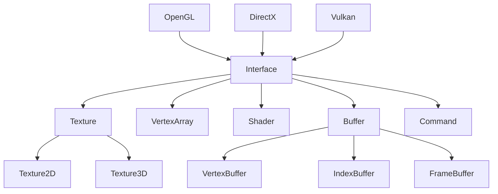

# TODO

## Feature

Platform: Windows

API: OpenGL

Build: premake, ~~cmake~~ 

- [ ] Component
	- [ ] Camera
	- [ ] Transform
	- [ ] Material
	- [ ] Geometry
		- [ ] Sphere
		- [ ] Plane
		- [ ] Cube
	- [ ] Light
		- [ ] Point Light
		- [ ] Rectangle Light
		- [ ] Spot Light
		- [ ] Directional Light
- [ ] Offline Rendering
	- [ ] Path Tracing
- [ ] Digital Geometry Processing
	- [ ] Parameterization
	- [ ] Minimum Surface
	- [ ] Loop Subdivision
- [ ] Physics Simulation System

Continuing updating...

## Structure

### Renderer

### Engine

* Logging System
* Profile System
* Event System
* File System
* Layer System

### Scene

* Entity Component System

### Editor

* UI

